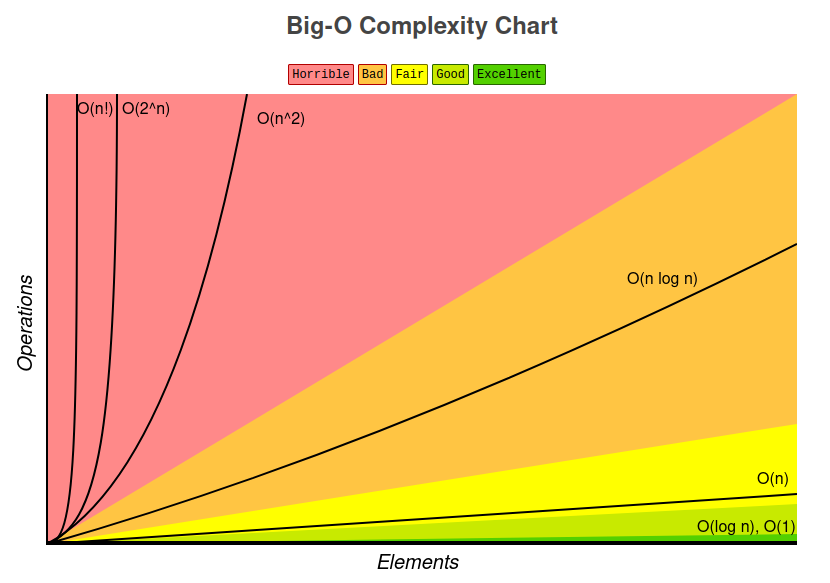
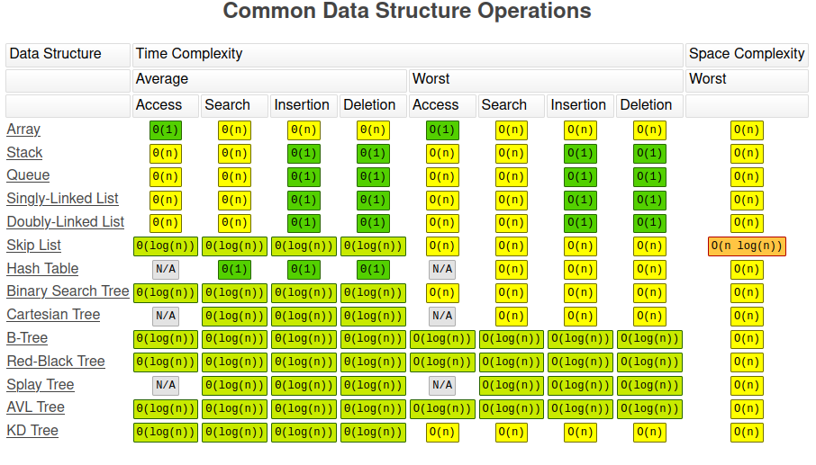
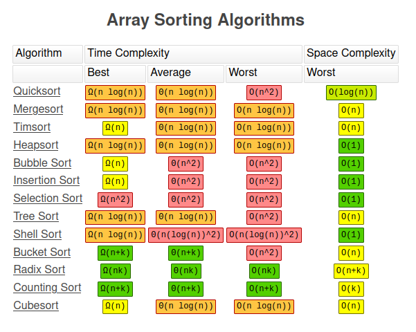

### Best Case Time Complexity

| Data Structure       | Access | Search | Insertion | Deletion |
|----------------------|--------|--------|-----------|----------|
| Array                | O(1)   | O(1)   | O(1)      | O(1)     |
| Stack                | O(1)   | O(1)   | O(1)      | O(1)     |
| Queue                | O(1)   | O(1)   | O(1)      | O(1)     |
| Singly Linked List   | O(1)   | O(1)   | O(1)      | O(1)     |
| Doubly Linked List   | O(1)   | O(1)   | O(1)      | O(1)     |
| Hash Table           | O(1)   | O(1)   | O(1)      | O(1)     |
| Binary Search Tree   | O(log n) | O(log n) | O(log n) | O(log n) |
| AVL Tree             | O(log n) | O(log n) | O(log n) | O(log n) |
| B Tree               | O(log n) | O(log n) | O(log n) | O(log n) |
| Red-Black Tree       | O(log n) | O(log n) | O(log n) | O(log n) |

### Worst Case Time Complexity

| Data Structure       | Access | Search | Insertion | Deletion |
|----------------------|--------|--------|-----------|----------|
| Array                | O(1)   | O(n)   | O(n)      | O(n)     |
| Stack                | O(n)   | O(n)   | O(1)      | O(1)     |
| Queue                | O(n)   | O(n)   | O(1)      | O(1)     |
| Singly Linked List   | O(n)   | O(n)   | O(1)      | O(1)     |
| Doubly Linked List   | O(n)   | O(n)   | O(1)      | O(1)     |
| Hash Table           | O(n)   | O(n)   | O(n)      | O(n)     |
| Binary Search Tree   | O(n)   | O(n)   | O(n)      | O(n)     |
| AVL Tree             | O(log n) | O(log n) | O(log n) | O(log n) |
| B Tree               | O(log n) | O(log n) | O(log n) | O(log n) |
| Red-Black Tree       | O(log n) | O(log n) | O(log n) | O(log n) |

### Average Case Time Complexity

| Data Structure       | Access | Search | Insertion | Deletion |
|----------------------|--------|--------|-----------|----------|
| Array                | O(1)   | O(n)   | O(n)      | O(n)     |
| Stack                | O(n)   | O(n)   | O(1)      | O(1)     |
| Queue                | O(n)   | O(n)   | O(1)      | O(1)     |
| Singly Linked List   | O(n)   | O(n)   | O(1)      | O(1)     |
| Doubly Linked List   | O(n)   | O(n)   | O(1)      | O(1)     |
| Hash Table           | O(1)   | O(1)   | O(1)      | O(1)     |
| Binary Search Tree   | O(log n) | O(log n) | O(log n) | O(log n) |
| AVL Tree             | O(log n) | O(log n) | O(log n) | O(log n) |
| B Tree               | O(log n) | O(log n) | O(log n) | O(log n) |
| Red-Black Tree       | O(log n) | O(log n) | O(log n) | O(log n) |

